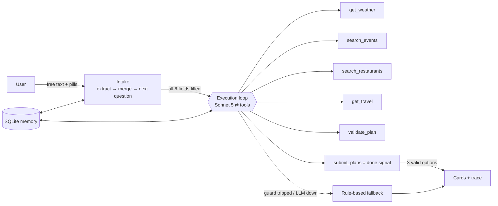

# Perfect Saturday Planner

A small AI agent that plans one person's Saturday. You chat with it in free text. It asks only for what's still missing, then runs a bounded tool-calling loop over (mocked) events, restaurants, weather and travel data. It returns three validated options: **Time Saver · Recommended · Value for Money**. Under the planning message, a collapsible trace shows a live one-line glimpse of what the agent is doing, and every thinking step and tool call when expanded.

- **Model:** Claude Sonnet 5 via OpenRouter (`anthropic/claude-sonnet-5`)
- **Backend:** Python 3.12, FastAPI, SQLite
- **Frontend:** React, TypeScript, Vite, Tailwind

```
backend/    agent harness + API  (uv run pytest → 100 tests, no network needed)
frontend/   chat UI, suggestion pills, live trace, plan cards
```

## How it works



### 1. Intake (conversational data acquisition)

- **Opening:** "How should we plan your Saturday?" Type anything, e.g. `i am at gurgaon, and my budget is ₹3000`.
- **Extraction:** each turn, Sonnet 5 (strict JSON-schema output, reasoning off) pulls out whatever fields the message contains. That can be several at once, plus corrections ("actually 2000") and constraints mentioned in passing.
- **Next question:** deterministic code asks for the next missing field, in the order city → budget → time → **mood → interests** → constraints.
  - Each question comes with suggestion pills. Tapping a pill inserts its text into the box, and you can keep typing around it.
  - Each question also has an example placeholder.
- **The agent doesn't run until all six required fields are filled.**
- **Vague answers:** "not too pricey" gets a clarifying re-ask with pills, at most twice. After that a default is used and stated in the plan's assumptions.
- **Unsupported city:** says so and offers the 4 cities that have data.
- **LLM unavailable:** a regex extractor keeps the conversation going.

### 2. The harness

| Pillar | What it does | Where |
|---|---|---|
| **Execution loop** | Calls the model, runs the tool calls it asks for (in parallel), appends the results, and repeats until the done check passes. Every exit is bounded. | `backend/app/agent/loop.py` |
| **Tools** | 5 mocked tools plus the terminal `submit_plans`. Each has a Pydantic arg schema (→ JSON schema for the model), a timeout, a per-run cap, a dedupe cache, and structured errors. | `backend/app/tools/` |
| **Memory** | Session: slots and the conversation, which resume after a reload. Run: every trace is persisted. Cross-session: a profile (home city, budget, constraints, past places, the option you picked) keyed by an anonymous browser id. It pre-fills pills and tells the planner not to repeat past venues. Nothing is auto-filled. | `backend/app/memory.py` |

**Done check.** The model finishes only by calling `submit_plans` with one option of each kind. The harness re-validates all three, and accepts only if none fails. Rejections go back to the model to fix, up to 3 attempts.

**Guards (no infinite loops).** Any trip hands off to the fallback:
- at most 8 model calls and 40 tool calls per run
- a cap on each tool (e.g. weather 2, validate 6, submit 3)
- identical calls are answered from a cache
- a 150 s run deadline, 90 s per model call and 5 s per tool
- one nudge if the model answers without calling a tool

**The validator never trusts the model's arithmetic.** It rebuilds each option from place IDs and checks:
- **Grounding:** every ID exists *and* was returned by a search in this run.
- **Timing:** events start only at their listed showtimes, and places are visited only within opening hours.
- **Travel:** there's enough time to travel between stops and to get back before the window ends. Time Saver rides cabs, Recommended uses the suggested mode, and Value uses the cheapest sensible mode.
- **Budget:** the all-in cost (tickets + food + travel) is within budget. Recommended may go up to 110% *only* if a trade-off says so.
- **Constraints:** diet, no alcohol, wheelchair access, back-by time, and no "high" crowd levels for crowd-averse users.
- **Weather:** outdoor stops during bad weather need an explicit trade-off.

### 3. Tools (all mocked; each is one handler file, so any can be swapped for a real API)

| Tool | Returns |
|---|---|
| `get_weather(city)` | Hourly temperature, rain and AQI within your window, plus the windows when being outdoors is fine |
| `search_events(categories, max_price, indoor_only, area)` | Events with showtimes and duration, and activities with opening hours. Includes crowd level by time, indoor/outdoor, and **cheaper alternatives** |
| `search_restaurants(max_cost_for_one, area, cuisine)` | Cost for **one person**, veg type, hours and crowd levels, with **cheaper alternatives** |
| `get_travel(legs[])` | km, minutes and fare for walk / auto / cab / metro, plus a suggested mode. Uses haversine × road factor, city traffic by hour, and city fares |
| `validate_plan(options[])` | Real totals and a list of violations to fix |
| `submit_plans(options[3] \| use_last_validated)` | Accepted or rejected with the problems. This is the done signal |

The mock data covers Bangalore, Gurgaon, Delhi and Mumbai: about 28 real-sounding places each, with Saturday showtimes, plausible prices and late-September weather (`backend/app/data/*.json`).

## Failure handling (all can be demoed)

| Case | What happens |
|---|---|
| Unsupported city ("Jaipur") | The agent never runs. The chat lists the supported cities as pills |
| Vague input | A clarifying question with pills, at most twice, then a stated default |
| Nothing fits (₹100 for 6 hours) | The closest valid plan, with "couldn't fit X" noted |
| Tool outage (`weather_down`, `no_restaurants`) | The model gets a structured error, adapts, and says so in the plan |
| LLM down, out of credits, or a guard trip | A deterministic rule-based planner builds the three options from the same data and validator, and a banner explains why |

Open **How I planned this** under a finished plan, then **Test how it copes**, to re-run it with one of those simulations (`POST /plan?simulate=weather_down`).

## Run it locally

```bash
# backend (http://localhost:8000)
cd backend
cp .env.example .env               # add OPENROUTER_API_KEY; without it, the rule-based paths take over
uv sync
uv run uvicorn app.main:create_app --factory --reload
uv run pytest                      # 100 tests, scripted fake LLM, no network

# frontend (http://localhost:5173, proxies /api to :8000)
cd frontend
npm install
npm run dev                        # add ?demo=1 to preview the UI with fixture data
```

## Decisions and trade-offs

- **Deterministic around the model, model where it adds value.** The LLM understands free text and composes plans. Code owns question order, arithmetic, validation and the stop condition. That makes the product predictable and testable (the fake LLM drives every path in tests).
- **A terminal tool as the done signal**, rather than "stop when the model stops calling tools". Completion is then a checked state, not a guess.
- **Grounding by ID.** The model can only reference places a tool returned in this run, which removes hallucinated venues and prices.
- **OpenRouter over the OpenAI-compatible API.** The model is one env var, and assistant messages are replayed verbatim so Claude's `reasoning_details` survive tool turns. The system prompt is static and history is append-only, which makes automatic prompt caching effective.
- **Cost:** a planning run is about 4–6 model calls, roughly $0.08–0.15 at Sonnet 5 prices (shown live in the trace). Rate limits (per user, per IP, global per day) protect the demo key.
- **Mock data first.** The tool interfaces are shaped like real APIs, so real data is a per-tool swap: Open-Meteo for weather (free, no key), OSM Overpass / Foursquare for places, OSRM for travel times.

## Deploying (prepared, not done yet)

- **Backend on Railway:** root `backend/`, Dockerfile build, a volume at `/data`. Env: `OPENROUTER_API_KEY`, `ALLOWED_ORIGINS=<vercel url>`.
- **Frontend on Vercel:** root `frontend/`, env `VITE_API_URL=<railway url>`.
